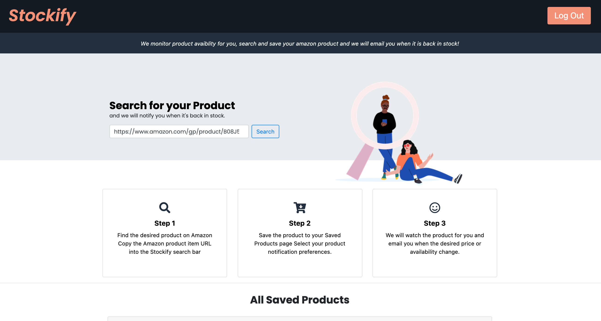

# Stockify 
This application uses web scraping technology and allows users to save 'out-of-stock' Amazon products to the app, save to their profile and then receive an email alert when an item is available again or the product price dropped.

 
 ## Table of Contents 
  * [Deployed Link](#Deployed-Link)
  * [Technologies](#Technologies)
 * [Contributors](#Contributors) 
  * [Questions](#Questions) 
 
# 🔗 Deployed Link
https://rocky-mountain-58303.herokuapp.com/

# ⚙️ Technologies
* React
* Express
* Nightmare
* Nodemailer
* MongoDB
* Bootstrap
* Auth0

# 🤓 Contributors
* Greg Malone 
* Emily Aguirre 
* Steve Rodriguez 

